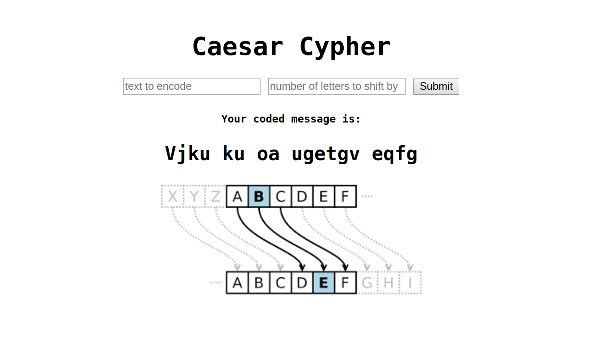

# Caesar Cypher

This projects uses a Caesar Cypher - a basic form of encryption - to encode any user input. You can try out the live app [here](https://blooming-brushlands-58622.herokuapp.com/).

The application takes a text and a number input from the user, and replaces each letter of the text by 'shifting' it by the number. So an input of "A, 3" produces "D", as the letter D is three places down from A.  

This project went through three iterations. The first was a simple Ruby script, the second was to add Rspec tests, and the third was to use Sinatra to add a front-end.



It's a project from [The Odin Project](https://www.theodinproject.com/courses/ruby-on-rails/lessons/sinatra-project).

## The Cypher

From Wikipedia:

> In cryptography, a Caesar cipher, also known as Caesar’s cipher, the shift cipher, Caesar’s code or Caesar shift, is one of the simplest and most widely known encryption techniques. It is a type of substitution cipher in which each letter in the plaintext is replaced by a letter some fixed number of positions down the alphabet. For example, with a left shift of 3, D would be replaced by A, E would become B, and so on. The method is named after Julius Caesar, who used it in his private correspondence.

## Installation

Open terminal/command line, navigate to the directory where you want this project to go, and type:
```
$ git clone https://github.com/JonoSenior/caesar_cypher.git
$ cd caesar_cypher
$ ruby lib/caesar_cypher.rb
```

## Thoughts

  * This is my first time creating and deploying a web app of my own creation. It's great to finally understand what the Gemfile, Gemfile.lock and config.ru files do, after seeing them in so many repos.
